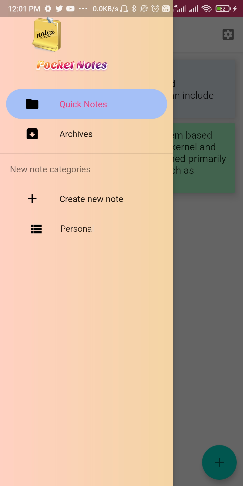
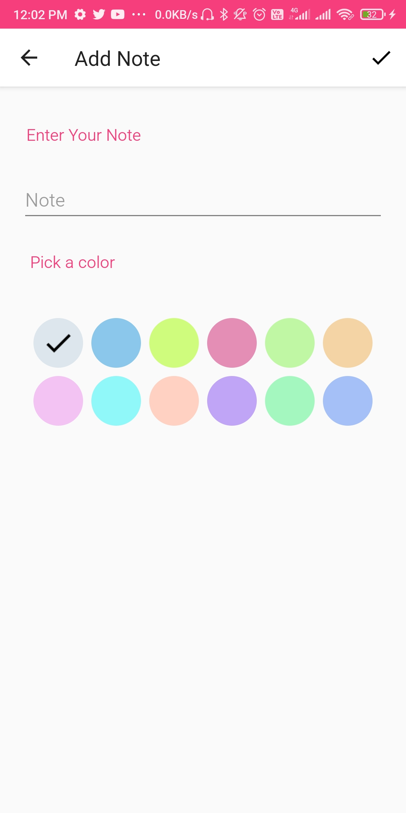

# 📝 Pocket-Notes

**Pocket-Notes** is a simple and secure note-taking app designed for daily use. With a clean and user-friendly UI, it allows you to organize your thoughts, lists, and ideas effortlessly — while also providing powerful privacy features.
<div align="center">


<a href="mailto:nesar.kaunain@gmail.com"></a>

</div>

---

## 🚀 Features

- ✅ **Simple, Minimal UI** – Clean and modern design for a smooth writing experience.
- 🔐 **Biometric Lock (Fingerprint)** – Protect your Archive notes with fingerprint authentication.
- 🗂️ **Archive Section** – Move important notes to a **Fingerprint** password-protected archive for enhanced privacy.
- 🫣 **Hide Note Categories** – Swipe right to hide entire categories of notes for a clutter-free view.
- 🌙 **Dark Mode Friendly** – Read and write comfortably in low light.

---

## 📂 Hide Categories by Swiping

- You can hide/archive **note categories** easily by swiping right on them. This helps to declutter your workspace and keep sensitive content out of sight.

- Archived notes has a **Fingerprint Biometric Support** for your enhanced privacy.


---

## 📸 App Previews

| Main Screen | Notes View | Add Note |
|-------------|------------|----------|
|  |  |  |

---

## 🔐 The Safest Notes App Ever

Your privacy is our priority. Pocket-Notes ensures your private thoughts remain secure with fingerprint protection, a password-protected archive, and the ability to hide categories.

---

## ⭐ Support This Project

If you like this project, please consider giving it a **🌟 star** on GitHub. It helps others discover the project and keeps the motivation going!

```bash
git clone https://github.com/kaunain26/pocket-notes.git
```

Feel free to fork, improve, and contribute 🙌

---

## 📥 Start Writing Today

Stay organized and protect your ideas – all in one place.
